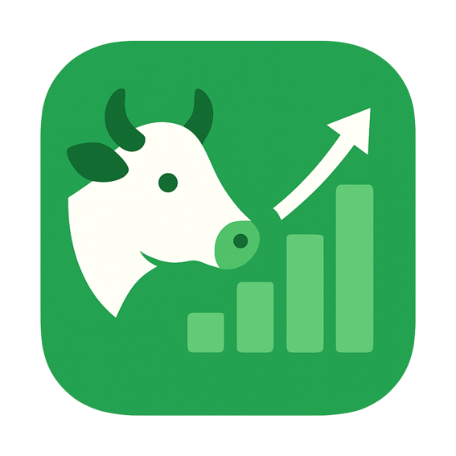

# 🐄 BoviCheck

<div align="center">



**Um aplicativo completo para gerenciamento de rebanho bovino, cálculo de índices zootécnicos e análise de produtividade.**

[](https://flutter.dev)
[](https://dart.dev)
[](LICENSE)

</div>

---

## 📋 Índice

- [Sobre o Projeto](#-sobre-o-projeto)
- [Funcionalidades](#-funcionalidades)
- [Tecnologias Utilizadas](#-tecnologias-utilizadas)
- [Requisitos](#-requisitos)
- [Instalação](#-instalação)
- [Estrutura do Projeto](#-estrutura-do-projeto)
- [Como Usar](#-como-usar)
- [Capturas de Tela](#-capturas-de-tela)
- [Contribuindo](#-contribuindo)
- [Licença](#-licença)

---

## 🎯 Sobre o Projeto

O **BoviCheck** é uma solução completa desenvolvida em Flutter para gestão de rebanhos bovinos. O aplicativo permite que produtores rurais gerenciem seus animais, calculem índices zootécnicos importantes e analisem a produtividade do rebanho de forma intuitiva e eficiente.

### Principais Diferenciais

- ✅ **Interface moderna e responsiva** com Material Design 3
- ✅ **Análise inteligente** com IA para avaliação de desempenho
- ✅ **Cálculos automáticos** de índices zootécnicos
- ✅ **Exportação de dados** para Excel e PDF
- ✅ **Backup e restauração** de dados
- ✅ **Suporte** (Android)

---

## ✨ Funcionalidades

### 🏠 Dashboard
- Visão geral do rebanho com estatísticas principais
- Análise inteligente com IA (Powered by Gemini)
- Indicadores globais e por lote
- Gráficos de evolução temporal
- Ações rápidas para navegação

### 🐄 Gestão de Animais
- **Cadastro completo** de animais com dados básicos
- **Histórico de pesagens** com gráficos de evolução
- **Registros de saúde** (eventos e medicações)
- **Controle reprodutivo** (cios, inseminações, partos)
- **Produção de leite** (registro diário)
- **Análise individual** de desempenho por animal

### 📊 Indicadores Zootécnicos
- Taxa de Natalidade
- Taxa de Prenhez
- Taxa de Desmame
- Taxa de Mortalidade
- Idade ao 1º Parto
- Intervalo Entre Partos
- GMD (Ganho Médio Diário) Nascimento-Desmame
- Produção Média Diária de Leite

### 🏡 Gestão de Propriedades e Lotes
- Cadastro de propriedades rurais
- Organização de animais em lotes
- Visualização detalhada por propriedade e lote
- Relatórios por lote

### 📈 Análises e Relatórios
- Histórico de análises com gráficos
- Exportação para Excel (.xlsx)
- Geração de relatórios em PDF
- Análise comparativa por período

### ⚙️ Configurações
- **Temas**: Claro, Escuro ou Sistema
- **Cores dinâmicas**: Adaptação automática (Android 12+)
- **Cores manuais**: Personalização da paleta
- **Backup e Restauração**: Proteção dos dados
- **Exportação de dados**: JSON para debug

---

## 🛠 Tecnologias Utilizadas

### Framework e Linguagem
- **Flutter** 3.2.3+
- **Dart** 3.2.3+

### Principais Dependências

#### Gerenciamento de Estado
- `provider` ^6.1.2 - Gerenciamento de estado reativo

#### Banco de Dados
- `sqflite` ^2.3.3+1 - Banco de dados SQLite local
- `sqflite_common_ffi` ^2.3.3 - Suporte para desktop

#### Interface e Visualização
- `fl_chart` ^0.68.0 - Gráficos e visualizações
- `flutter_animate` ^4.5.0 - Animações suaves
- `dynamic_color` ^1.7.0 - Cores dinâmicas (Material You)

#### Exportação e Arquivos
- `excel` ^4.0.2 - Geração de planilhas Excel
- `pdf` ^3.10.8 - Geração de PDFs
- `printing` ^5.12.0 - Impressão e compartilhamento
- `file_picker` ^8.0.1 - Seleção de arquivos

#### Utilitários
- `intl` ^0.20.2 - Internacionalização e formatação
- `uuid` ^4.4.0 - Geração de IDs únicos
- `shared_preferences` ^2.2.3 - Armazenamento de preferências
- `flutter_dotenv` ^6.0.0 - Gerenciamento de variáveis de ambiente

---

## 📱 Requisitos

### Para Desenvolvimento
- Flutter SDK >= 3.2.3
- Dart SDK >= 3.2.3
- Android Studio / VS Code com extensões Flutter
- Git

### Para Execução
- **Android**: API 21+ (Android 5.0+)
- **Windows**: Windows 10+

---

## 🚀 Instalação

### 1. Clone o repositório

```bash
git clone https://github.com/seu-usuario/bovicheck.git
cd bovicheck
```

### 2. Instale as dependências

```bash
flutter pub get
```

### 3. Configure o arquivo .env

Crie um arquivo `.env` na raiz do projeto com as variáveis necessárias:

```env
# Exemplo de configuração
# Adicione suas chaves de API se necessário
```

### 4. Execute o aplicativo

```bash
# Para Android/iOS
flutter run

# Para Web
flutter run -d chrome

# Para Windows
flutter run -d windows

# Para Linux
flutter run -d linux

# Para macOS
flutter run -d macos
```

### 5. Gere o ícone do aplicativo (Opcional)

```bash
flutter pub run flutter_launcher_icons
```

---

## 📁 Estrutura do Projeto

```
bovicheck/
├── lib/
│   ├── controllers/          # Controladores de estado
│   │   ├── animal_detail_controller.dart
│   │   ├── animal_list_controller.dart
│   │   ├── dashboard_controller.dart
│   │   └── herd_indicators_controller.dart
│   ├── models/               # Modelos de dados
│   │   ├── animal/          # Modelos relacionados a animais
│   │   ├── lote.dart
│   │   ├── propriedade.dart
│   │   └── analysis_snapshot.dart
│   ├── providers/            # Providers (tema, etc.)
│   │   └── theme_provider.dart
│   ├── services/             # Serviços e lógica de negócio
│   │   ├── database_service.dart
│   │   ├── herd_analysis_service.dart
│   │   ├── ai_evaluation_service.dart
│   │   ├── spreadsheet_service.dart
│   │   ├── pdf_export_service.dart
│   │   └── ...
│   ├── styles/               # Estilos e temas
│   │   ├── app_colors.dart
│   │   ├── app_icons.dart
│   │   └── app_theme.dart
│   ├── views/                # Telas do aplicativo
│   │   ├── animal/          # Telas relacionadas a animais
│   │   │   ├── animal_detail_view.dart
│   │   │   ├── animal_form_view.dart
│   │   │   ├── animal_list_view.dart
│   │   │   └── tabs/       # Abas de detalhes do animal
│   │   ├── lotes/           # Gestão de lotes
│   │   ├── propriedade/     # Gestão de propriedades
│   │   ├── settings/        # Configurações
│   │   ├── dashboard_view.dart
│   │   ├── herd_indicators_view.dart
│   │   └── ...
│   ├── widgets/             # Widgets reutilizáveis
│   │   ├── app_drawer.dart
│   │   ├── ai_analysis_card.dart
│   │   └── app_version_footer.dart
│   └── main.dart           # Ponto de entrada
├── assets/                  # Recursos (ícones, imagens)
├── android/                 # Configurações Android
├── ios/                     # Configurações iOS
├── windows/                 # Configurações Windows
├── linux/                   # Configurações Linux
├── macos/                   # Configurações macOS
├── web/                     # Configurações Web
├── pubspec.yaml            # Dependências e configurações
└── README.md               # Este arquivo
```

---

## 📖 Como Usar

### Primeiros Passos

1. **Cadastre uma Propriedade**
   - Acesse Configurações → Propriedades
   - Adicione os dados da propriedade rural

2. **Crie um Lote**
   - Acesse Lotes → Novo Lote
   - Associe o lote a uma propriedade

3. **Cadastre os Animais**
   - Acesse Meu Rebanho → Novo Animal
   - Preencha os dados básicos do animal
   - Associe o animal a um lote

4. **Registre Eventos**
   - Acesse o animal → Aba correspondente
   - Registre pesagens, eventos de saúde, reprodução, etc.

5. **Visualize Indicadores**
   - Acesse Dashboard ou Indicadores do Rebanho
   - Veja os índices calculados automaticamente

### Funcionalidades Principais

#### 📊 Dashboard
- Visualize estatísticas gerais do rebanho
- Veja análises inteligentes geradas por IA
- Acesse rapidamente outras seções do app

#### 🐄 Gestão de Animais
- **Resumo**: Dados básicos e desempenho geral
- **Pesagens**: Histórico completo com gráficos
- **Saúde**: Eventos de saúde e medicações
- **Produção**: Registros de produção de leite (fêmeas)
- **Reprodução**: Eventos reprodutivos (fêmeas)

#### 📈 Indicadores
- Selecione o período de análise
- Visualize indicadores reprodutivos e de rebanho
- Acesse histórico detalhado de cada indicador

#### 💾 Backup e Exportação
- **Backup**: Crie backups locais dos seus dados
- **Excel**: Exporte todos os dados para planilha
- **PDF**: Gere relatórios completos em PDF

---

## 🎨 Capturas de Tela

> **Nota**: Adicione capturas de tela do aplicativo aqui para melhor visualização.

### Dashboard
- Visão geral com estatísticas e análises

### Gestão de Animais
- Lista de animais com filtros
- Detalhes completos por animal

### Indicadores
- Cards visuais com progresso
- Gráficos de evolução temporal

## 📝 Licença

Este projeto está sob a licença MIT. Veja o arquivo `LICENSE` para mais detalhes.

---

## 👨‍💻 Desenvolvimento

Desenvolvido para produtores rurais

---

## 🙏 Agradecimentos

- Flutter Team pela excelente framework
- Comunidade Flutter pelo suporte
- Todos os mantenedores dos pacotes utilizados

---

## 📞 Suporte

Para dúvidas, sugestões ou problemas:

- Abra uma [Issue](https://github.com/hugosb2)
- Entre em contato através do email: [hugobs4987@gmail.com]

---

<div align="center">

**⭐ Se este projeto foi útil para você, considere dar uma estrela! ⭐**

Feito com ❤️ usando Flutter

</div>
